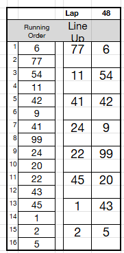
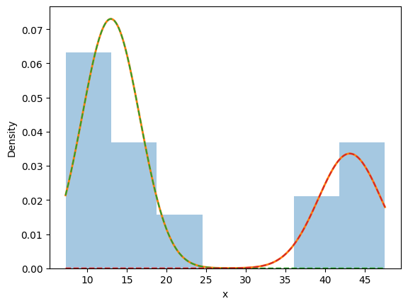

# Wise Optimization - Project - Rohan Kotwani

There are two data sources that were used: 1) the previous running order of cars (what place they are in) for each lap and 2) the statistics by car and lap at each chose cone.

The choice cone is the lap where the caution flag turns from yellow to green. At this point, the driver can decide to either take the inner or outer side of the track. While the outer side might be preferable, the inner side can increase the short term position of a driver.

Here we see the previous running order was 6, 77, 54… And we see that driver 6 went to the outer side of the track while driver 77 went to the inner side. Whether the driver went inner/outer is the line up order.



For example, at the beginning of the lap, for when the flag turns from yellow to green at the end of the lap, the previous running order was recorded.

Since the data is recorded at the end of the lap, if the flag changes to green on lap 35, then the running order at lap 34 will show the previous running order.

Next, the driver's choice of inner or outer is determined by measuring their distance to the wall, when the flag turns green, at the start of the next lap (say lap 36).

A statistical model to divide the group of cars by distance to the wall. I excluded any cars more than 95 feet from the wall and recorded them as pit stops.



This has the benefit of assigning some uncertainty to the categories, but, also, it can possibly be used to find restart periods.

After categorizing each driver into the inner/outer category, the next step was to find the line up order. This was done by 2) sorting the the drivers by the running order of the lap where the caution period end and 2) splitting and then stacking the drivers who went 1) inner and 2) outer side by side.

However, it is unclear if the previous running order should show drivers that are not in the top 16 line-up after the green flag.

For example, here is the order on lap 60, the end of the caution period:

```
22 2 21 48 19 47 7 17 34 71 6 11 1 12 42 38
```
